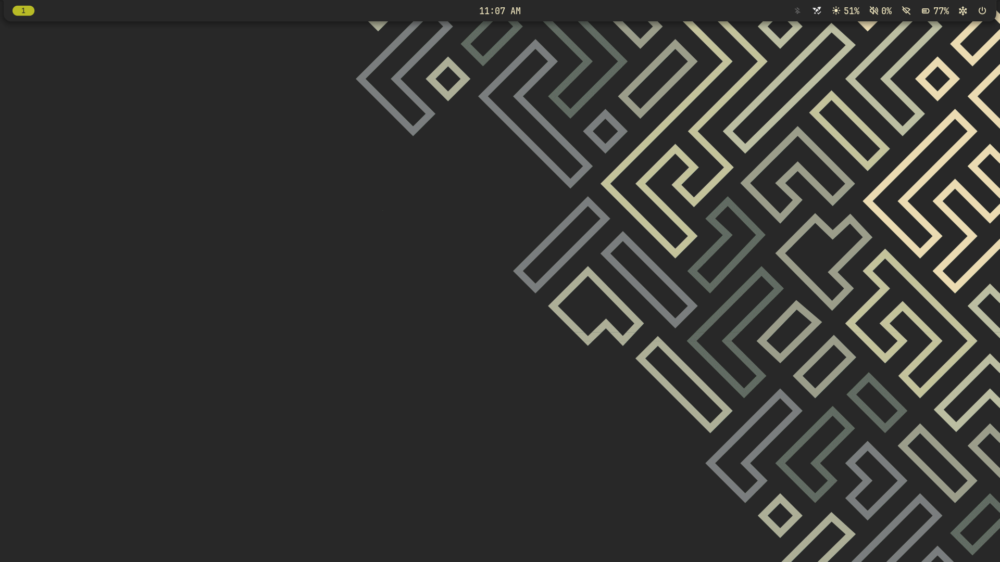
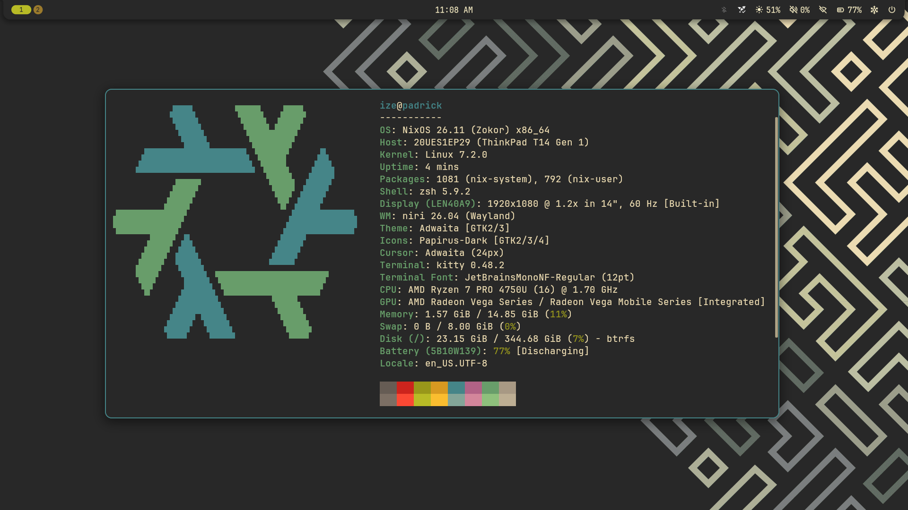

# nixos-conf

A multi-host, cross-platform NixOS and macOS configuration using flakes and Home Manager. A gruvbox themed (mostly) configuration implemented with Noctalia, Niri, and Hyprland.

## Desktops

| | |
|---|---|
|  |  |

## Structure

```
.
├── flake.nix                  # Minimal flake entry point (inputs only, outputs delegated)
├── outputs/                   # Flake outputs (nixosConfigurations, checks, devShells, etc.)
│   └── default.nix            # All outputs extracted here for clean separation
├── .envrc                     # direnv integration (use flake)
├── lib/                       # Custom Nix library helpers (scanPaths, relativeToRoot)
├── overlays/                  # Nixpkgs overlays (auto-loaded from individual files)
│   ├── default.nix            # Auto-imports all .nix files in this directory
│   └── packages.nix           # Package overlays (gruvbox-material-yazi, version pinning)
├── pkgs/                      # Custom packages (gruvbox-material-yazi.yazi)
├── scripts/                   # Utility scripts (output-scale)
├── hosts/                     # Per-host system configurations
│   ├── nixos/                 # NixOS hosts
│   │   ├── padrick/           # ThinkPad T14 AMD Gen1 (daily use)
│   │   │   ├── default.nix    # Host config (imports modules, enables features)
│   │   │   ├── hardware-configuration.nix
│   │   │   ├── hardware.nix   # Kernel params, swap, VA-API
│   │   │   ├── packages.nix   # Host-specific system packages
│   │   │   └── services.nix   # TLP, UPower, mic-mute LED sync
│   │   └── jobert/            # AMD + NVIDIA gaming laptop
│   │       ├── default.nix
│   │       ├── hardware-configuration.nix
│   │       ├── hardware.nix   # NVIDIA driver, pinned kernel (7.2), boot params, session vars
│   │       ├── packages.nix
│   │       └── services.nix   # auto-cpufreq, UPower, systemd-resolved
│   └── darwin/                # macOS hosts (scaffolded, pending implementation)
├── modules/                   # System modules
│   ├── nixos/                 # NixOS-specific modules
│   │   ├── core/              # Shared by all NixOS hosts (auto-imported via scanPaths)
│   │   │   ├── system.nix     # Boot, networking, nix settings, user accounts, kernelPackage option
│   │   │   ├── locale.nix     # Timezone, locale
│   │   │   ├── ssh.nix        # OpenSSH (key-based auth only)
│   │   │   ├── secrets.nix    # agenix secret declarations, identityPaths, token include
│   │   │   ├── security.nix   # Neovim, nix-ld, firewall
│   │   │   └── packages.nix   # Base system packages
│   │   ├── desktop/           # Desktop environment (auto-imported via scanPaths)
│   │   │   ├── greetd.nix     # Login manager (tuigreet)
│   │   │   ├── niri.nix       # Niri Wayland compositor
│   │   │   └── services.nix   # Pipewire, fonts, rtkit, bluetooth
│   │   ├── features/          # Optional feature modules (mkEnableOption, auto-imported)
│   │   │   ├── btrfs.nix      # BTRFS compression/tuning options (myfeatures.btrfs.enable)
│   │   │   ├── secureboot.nix # UEFI Secure Boot via Lanzaboote
│   │   │   ├── gaming.nix     # Steam, Gamescope, Gamemode, MangoHud
│   │   │   ├── vm.nix         # QEMU/KVM + virt-manager
│   │   │   ├── zswap.nix      # Zswap with zstd compression
│   │   │   └── p2p.nix        # Syncthing + NetBird
│   │   └── default.nix        # Aggregator (imports core, desktop, features)
│   └── darwin/                # macOS-specific modules (placeholder)
│       └── default.nix
├── secrets/                   # Encrypted secrets (agenix)
│   ├── nixos.nix              # NixOS public key declarations for each secret
│   ├── darwin.nix             # macOS public key declarations (placeholder)
│   ├── nix-access-tokens.age  # Nix/GitHub access tokens (encrypted)
│   └── netbird-setup-key.age  # NetBird VPN setup key (encrypted)
├── home/                      # Home Manager modules
│   ├── core/                  # Cross-platform (shell, packages, editors, terminal)
│   │   ├── default.nix        # Aggregator + stateVersion, username, platform-aware homeDirectory
│   │   ├── shell.nix          # Bash, zsh, git, starship, zoxide, aliases
│   │   ├── git.nix            # Git configuration
│   │   ├── packages.nix       # CLI tools (fd, fzf, ripgrep, opencode, etc.)
│   │   ├── xdg.nix            # XDG user directories
│   │   ├── terminal.nix       # Kitty terminal
│   │   ├── nvim.nix           # Neovim LazyVim config (store copy, recursive)
│   │   ├── starship.nix       # Starship prompt
│   │   ├── yazi.nix           # Yazi file manager + gruvbox theme
│   │   ├── tmux.nix           # Tmux config
│   │   └── obsidian.nix       # Obsidian
│   ├── linux/                 # Linux-only home modules
│   │   ├── default.nix        # Aggregator
│   │   ├── gtk.nix            # GTK theme, cursor
│   │   ├── hyprland.nix       # Hyprland config (store copy, recursive)
│   │   ├── niri.nix           # Niri config
│   │   ├── noctalia.nix       # Noctalia lockscreen/bar
│   │   ├── mimeapps.nix       # Nemo desktop entry + MIME associations
│   │   ├── scripts.nix        # Utility scripts (output-scale)
│   │   ├── packages.nix       # Desktop packages (waybar, mpv, discord-ptb, nemo, etc.)
│   │   ├── xdg.nix            # XDG portal config (xdg-desktop-portal-*)
│   │   └── zen-browser.nix    # Zen Browser
│   ├── darwin/                # macOS-only home modules (placeholder)
│   │   └── default.nix
│   └── hosts/                 # Host-specific HM overrides
│       ├── nixos/
│       │   ├── padrick/
│       │   │   ├── default.nix    # Imports core + linux, symlinks host configs
│       │   │   ├── packages.nix   # btop
│       │   │   └── config/        # Host-specific dotfiles
│       │   │       ├── niri-host-settings.kdl
│       │   │       ├── hypr-host-settings.lua
│       │   │       └── noctalia-host-settings.toml
│       │   └── jobert/
│       │       ├── default.nix
│       │       ├── packages.nix   # btop-cuda, chromium, prismlauncher
│       │       └── config/
│       │           ├── niri-host-settings.kdl
│       │           ├── hypr-host-settings.lua
│       │           └── noctalia-host-settings.toml
│       └── darwin/                # macOS host-specific HM (placeholder)
├── config/                    # Shared raw dotfiles (nvim, hypr, niri, kitty, tmux, noctalia)
└── .github/workflows/ci.yml  # CI: flake checks + dry builds for all hosts
```

## Quick Start

```bash
# Set up secrets (first time only)
# 1. Get your host's SSH public key: ssh-keyscan <hostname> 2>/dev/null | grep ssh-ed25519
# 2. Add keys to secrets/nixos.nix
# 3. Create encrypted secrets: sudo agenix -i /etc/ssh/ssh_host_ed25519_key -e <secret-name>.age

# Deploy for padrick
sudo nixos-rebuild switch --flake .#padrick

# Deploy for jobert
sudo nixos-rebuild switch --flake .#jobert

# Build without switching
nix build .#nixosConfigurations.padrick.config.system.build.toplevel

# Format all .nix files
nix fmt
```

## Updating

### Update All Flake Inputs

Update all inputs (nixpkgs, home-manager, etc.) to their latest revisions:

```bash
nix flake update
```

To update a specific input:

```bash
nix flake update nixpkgs
nix flake update home-manager
nix flake update niri
```

After updating, rebuild:

```bash
sudo nixos-rebuild switch --flake .#<hostname>
```

### Update a Specific Package

To update a single package (e.g. `ripgrep`) to the latest version in your pinned nixpkgs:

1. Check if a newer version exists:
   ```bash
   nix search nixpkgs#ripgrep
   ```

2. If you want the absolute latest (possibly newer than your pinned nixpkgs), update nixpkgs first:
   ```bash
   nix flake update nixpkgs
   sudo nixos-rebuild switch --flake .#<hostname>
   ```

3. To pin a specific package to a particular nixpkgs revision, add an overlay in `overlays/`:
   ```nix
   # overlays/ripgrep.nix
   final: prev: {
     ripgrep = prev.ripgrep.overrideAttrs (old: {
       version = "14.1.1";
       src = final.fetchFromGitHub {
         owner = "BurntSushi";
         repo = "ripgrep";
         rev = "14.1.1";
         sha256 = "sha256-...";
       };
     });
   }
   ```

### Roll Back to a Previous Generation

If a rebuild went wrong, roll back:

```bash
# List generations
sudo nix-env --list-generations --profile /nix/var/nix/profiles/system

# Switch to a previous generation
sudo nixos-rebuild switch --flake .#<hostname> --profile /nix/var/nix/profiles/system

# Or use the bootloader menu to select a previous generation
```

### Clean Up Old Generations

Older generations are automatically garbage-collected weekly (14-day retention, configured in `modules/nixos/core/system.nix`). To manually clean:

```bash
sudo nix-collect-garbage -d
```

## Adding a New NixOS Host

1. Create the host directory and generate hardware config:

   ```bash
   mkdir -p hosts/nixos/<name>
   mkdir -p home/hosts/nixos/<name>/config
   ```

2. On the target machine, generate the hardware config:

   ```bash
   sudo nixos-generate-config --show-hardware-config > hosts/nixos/<name>/hardware-configuration.nix
   ```

3. Create `hosts/nixos/<name>/default.nix` (see [hosts/README.md](hosts/README.md) for a template)
4. Create `hosts/nixos/<name>/hardware.nix`, `packages.nix`, `services.nix`
5. Create `home/hosts/nixos/<name>/default.nix` and `packages.nix`
6. Create `home/hosts/nixos/<name>/config/` with monitor configs:
   - `niri-host-settings.kdl` for host-specific Niri settings
   - `hypr-host-settings.lua` for host-specific Hyprland settings
   - `noctalia-host-settings.toml` for Noctalia (optional)
7. Add a new entry in `outputs/default.nix` (inside `mkNixosHost` calls):
   ```nix
   nixosConfigurations.<name> = mkNixosHost "<name>" "x86_64-linux";
   ```
   This also auto-generates a `{name}-eval` flake check (via `mapAttrs'` over `nixosConfigurations`), so no separate check block is needed.
8. Symlink the repo to `/etc/nixos` so the `bldflk` alias works:
   ```bash
   sudo ln -s /path/to/nixos-conf /etc/nixos
   ```
9. First deploy (generates SSH host keys):
   ```bash
   sudo nixos-rebuild switch --flake .#<name>
   ```
10. Grab the new host's SSH public key:
    ```bash
    ssh-keyscan <name> 2>/dev/null | grep ssh-ed25519
    ```
11. Add the key to `secrets/nixos.nix` and rekey (see [Secrets Management](#secrets-management))
12. Second deploy (decrypts secrets):
    ```bash
    sudo nixos-rebuild switch --flake .#<name>
    ```

See [hosts/README.md](hosts/README.md) for a detailed walkthrough with code examples.

## Adding a New macOS Host

> **Note:** macOS (darwin) support is scaffolded but not yet fully implemented. The `modules/darwin/`, `home/darwin/`, and `hosts/darwin/` directories exist with placeholder files.

1. Create the host directory: `mkdir -p hosts/darwin/<name>`
2. Create `hosts/darwin/<name>/default.nix` with macOS system settings
3. Create `home/hosts/darwin/<name>/default.nix` importing `../../core` + `../../darwin`
4. Add `modules/darwin/*.nix` for macOS system settings (`system.defaults.*`, `homebrew.*`, etc.)
5. Add `home/darwin/*.nix` for macOS-specific home config (Aerospace, CmdTap, etc.)
6. Add a `darwinConfigurations` entry in `outputs/default.nix` using `mkDarwinHost`

## Feature Options

Optional features are gated behind `mkEnableOption` in `modules/nixos/features/`. Enable them in your host's `default.nix`:

```nix
myfeatures = {
  btrfs.enable = true;       # BTRFS compression/tuning (compress=zstd:3, noatime, ssd)
  btrfs.mountPaths = [ "/" "/home" "/nix" ];  # Paths to apply options to (default)
  secureboot.enable = true;  # UEFI Secure Boot via Lanzaboote
  vm.enable = true;          # QEMU/KVM + virt-manager
  gaming.enable = true;      # Steam, Gamescope, Gamemode, MangoHud
  zswap.enable = true;       # Zswap with zstd compression
  p2p.enable = true;         # Syncthing + NetBird VPN
};
```

Adding a new feature: create `modules/nixos/features/<name>.nix` with `options.myfeatures.<name>.enable = lib.mkEnableOption "..."` and gate the config with `lib.mkIf cfg.enable`. It's auto-imported via `scanPaths`.

## Secrets Management

This config uses [agenix](https://github.com/ryantm/agenix) for managing encrypted secrets. Secrets are encrypted with [age](https://github.com/FiloSottile/age) using SSH host keys.

The flake passes `flakeRoot = self` via `specialArgs`, allowing modules to reference `.age` files in the repo root using absolute store paths. The `age.identityPaths` option is explicitly set in `modules/nixos/core/secrets.nix` to `/etc/ssh/ssh_host_ed25519_key`.

### How It Works

1. Secrets are encrypted with age using SSH public keys from each host
2. `secrets/nixos.nix` maps each `.age` file to the public keys that can decrypt it
3. Feature modules declare `age.secrets.<name>` pointing to the `.age` file
4. At boot, agenix decrypts secrets to `/run/agenix/` with the specified mode/owner
5. Services reference the decrypted path via `config.age.secrets.<name>.path`

### Setup (First Time)

1. Get your host's SSH public key:
   ```bash
   ssh-keyscan <hostname> 2>/dev/null | grep ssh-ed25519
   ```

2. Add the key to `secrets/nixos.nix`:
   ```nix
   let
     padrick = "ssh-ed25519 AAAA... root@padrick";
     jobert = "ssh-ed25519 AAAA... root@jobert";
     systems = [ padrick jobert ];
   in
   {
     "nix-access-tokens.age".publicKeys = systems;
     "netbird-setup-key.age".publicKeys = systems;
   }
   ```

3. Create encrypted secrets:
   ```bash
   sudo agenix -i /etc/ssh/ssh_host_ed25519_key -e nix-access-tokens.age
   sudo agenix -i /etc/ssh/ssh_host_ed25519_key -e netbird-setup-key.age
   ```

4. Deploy:
   ```bash
   sudo nixos-rebuild switch --flake .#<hostname>
   ```

### Current Secrets

| Secret | Required By | Purpose |
|--------|-------------|---------|
| `nix-access-tokens.age` | Always | Nix/GitHub access tokens for private flakes |
| `netbird-setup-key.age` | `myfeatures.p2p.enable = true` | NetBird VPN auto-login key |

### Adding a New Secret

1. Create the encrypted file:
   ```bash
   sudo agenix -i /etc/ssh/ssh_host_ed25519_key -e <secret-name>.age
   ```
   This opens `$EDITOR`. Write the secret, save, and quit to encrypt.

2. Declare public keys in `secrets/nixos.nix`:
   ```nix
   {
     # ...existing secrets...
     "<secret-name>.age".publicKeys = systems;
   }
   ```

3. Re-encrypt for all hosts:
   ```bash
   sudo agenix -i /etc/ssh/ssh_host_ed25519_key --rekey
   ```

4. Reference it in a NixOS module:
   ```nix
   age.secrets.<secret-name> = {
     file = "${flakeRoot}/secrets/<secret-name>.age";
     owner = "root";
     group = "root";
     mode = "0400";
   };
   ```

   Then use `config.age.secrets.<secret-name>.path` in your service config.

### Removing a Secret

1. Remove the declaration from `secrets/nixos.nix`
2. Delete the `.age` file: `rm secrets/<secret-name>.age`
3. Remove all `age.secrets.<secret-name>` declarations from module files
4. Re-encrypt (clears orphaned references): `sudo agenix -i /etc/ssh/ssh_host_ed25519_key --rekey`

### Editing Secrets

```bash
# Edit an encrypted secret (opens in $EDITOR)
sudo agenix -i /etc/ssh/ssh_host_ed25519_key -e <secret-name>.age

# Decrypt a secret to stdout (for debugging)
sudo agenix -i /etc/ssh/ssh_host_ed25519_key -d <secret-name>.age

# Re-encrypt all secrets after key changes
sudo agenix -i /etc/ssh/ssh_host_ed25519_key --rekey
```

### Adding a New Host

**Cold start (fresh install)?** SSH host keys are generated when OpenSSH starts (on first `nixos-rebuild switch`). You'll need two passes:

1. First deploy (generates SSH keys, enables services):
   ```bash
   sudo nixos-rebuild switch --flake .#newhost
   ```

2. Now grab the key:
   ```bash
   ssh-keyscan newhost 2>/dev/null | grep ssh-ed25519
   ```
   Or on the new machine directly:
   ```bash
   cat /etc/ssh/ssh_host_ed25519_key.pub
   ```

3. Add the key as a binding in `secrets/nixos.nix`:
   ```nix
   let
     newhost = "ssh-ed25519 AAAA... root@newhost";
     systems = [ padrick jobert newhost ];
   in
   ```

4. Re-encrypt all secrets for the new host:
   ```bash
   sudo agenix -i /etc/ssh/ssh_host_ed25519_key --rekey
   ```

5. Second deploy (decrypts secrets with the new key):
   ```bash
   sudo nixos-rebuild switch --flake .#newhost
   ```

### Resetting a Host (Lost SSH Keys)

If a host's SSH host key is lost or regenerated (e.g., after reinstalling), you need to update the key in `secrets/nixos.nix` and re-encrypt.

1. Get the new SSH public key from the host:
   ```bash
   ssh-keyscan <hostname> 2>/dev/null | grep ssh-ed25519
   ```

2. Update the key binding in `secrets/nixos.nix`:
   ```nix
   let
     # Replace the old key with the new one
     padrick = "ssh-ed25519 AAAA... root@padrick";
     systems = [ padrick jobert ];
   in
   ```

3. Re-encrypt all secrets (this re-encrypts with the new key):
   ```bash
   sudo agenix -i /etc/ssh/ssh_host_ed25519_key --rekey
   ```

4. Deploy from another host or from the target if it can already build:
   ```bash
   sudo nixos-rebuild switch --flake .#<hostname>
   ```

**Important:** If the lost host was the only one that could decrypt a secret, you'll need to re-create the secret from another host that still has access, or from a backup of the decrypted value.

### Using the agenix CLI

The agenix CLI needs the SSH host private key to decrypt secrets. Since the key is at `/etc/ssh/ssh_host_ed25519_key` (not in `~/.ssh/`), you must specify it with `-i`:

```bash
# Via the dev shell
nix develop
sudo agenix -i /etc/ssh/ssh_host_ed25519_key -e <secret>.age

# As a flake app (no dev shell needed)
sudo nix run .#agenix -- -i /etc/ssh/ssh_host_ed25519_key -e <secret>.age
```

**Note:** The NixOS module handles decryption at boot automatically (runs as root). The `-i` flag is only needed for manual CLI operations.

## Host-Specific Packages

**System packages** in `hosts/nixos/<name>/packages.nix`:

```nix
{ pkgs, ... }:

{
  environment.systemPackages = with pkgs; [
    # packages only needed on this host
  ];
}
```

**User packages** in `home/hosts/nixos/<name>/packages.nix`:

```nix
{ pkgs, ... }:

{
  home.packages = with pkgs; [
    # user packages only needed on this host
  ];
}
```

Shared packages live in `modules/nixos/core/packages.nix` (system) and `home/core/packages.nix` (user).

## Firewall

The firewall is enabled system-wide in `modules/nixos/core/security.nix` via `networking.firewall`. It blocks all inbound connections by default except for explicitly allowed ports.

### Open Ports

| Port | Protocol | Service | Condition |
|------|----------|---------|-----------|
| 51820 | UDP | NetBird (WireGuard) | `myfeatures.p2p.enable = true` |

Syncthing ports are opened automatically when `myfeatures.p2p.enable = true` via `services.syncthing.openDefaultPorts`.

### Adding Ports

To open additional ports, edit `modules/nixos/core/security.nix`:

```nix
networking.firewall = {
  allowedTCPPorts = [ 8080 ];
  # or use ranges:
  # allowedTCPPortRanges = [ { from = 8000; to = 8100; } ];
};
```

Feature-specific ports should be added to their respective feature modules (e.g., NetBird's UDP 51820 is in `modules/nixos/features/p2p.nix`).

## Optional Setup

### BTRFS: Disable COW for Steam

If you're using BTRFS, you may want to disable Copy-on-Write (COW) on the Steam downloads folder to avoid performance issues and excessive disk usage:

```bash
sudo chattr +C ~/.local/share/steam
```

This must be done before any files are written to the directory. If Steam is already installed, you'll need to move the folder, create a fresh one, apply the attribute, then move files back.

### Dual Boot with Windows

This config sets `time.hardwareClockInLocalTime = false` in `modules/nixos/core/locale.nix`, which means the hardware clock is stored in UTC. Windows assumes the hardware clock is local time by default, so time will be wrong when switching between OSes.

To fix this, run the following command in an **elevated Command Prompt** (Run as Administrator) on Windows:

```
reg add "HKEY_LOCAL_MACHINE\SYSTEM\CurrentControlSet\Control\TimeZoneInformation" /v RealTimeIsUniversal /t REG_DWORD /d 1 /f
```

This tells Windows to treat the hardware clock as UTC, matching Linux. Reboot Windows after running the command.

### GitHub Access Token

If you use private flakes or want to avoid GitHub rate limits:

```bash
# Create/edit the agenix secret
agenix -e nix-access-tokens.age

# Add your token in the format:
# access-tokens = github.com=ghp_GithubTokenHere
```

The token is automatically included in Nix configuration via `nix.extraOptions` in `modules/nixos/core/secrets.nix`. On first boot, an activation script ensures the token file exists before Nix reads it.

### NetBird Access Token

The NetBird setup key is managed via agenix:

```bash
# Create/edit the agenix secret
agenix -e netbird-setup-key.age
```

The key is automatically decrypted to `/run/agenix/netbird-setup-key` and referenced by the NetBird service.

### Syncthing Device IDs

Syncthing device IDs are configured inline in `modules/nixos/features/p2p.nix`. To change the server device ID, edit the `devices` attrset:

```nix
services.syncthing.settings.devices = {
  "Server".id = "YOUR-DEVICE-ID";
};
```

Get a device's ID from the Syncthing GUI under Actions > Show ID.

## Flake Inputs

| Input | Purpose |
|---|---|
| `nixpkgs` | NixOS packages (unstable) |
| `home-manager` | User environment management |
| `lanzaboote` | Secure Boot (UEFI), opt-in via `myfeatures.secureboot.enable` |
| `nixos-hardware` | NixOS hardware modules (AMD, laptop, SSD, etc.) |
| `agenix` | Encrypted secrets management (age + SSH keys) |
| `niri` | Niri Wayland compositor |
| `noctalia` | Wayland shell/bar |
| `zen-browser` | Zen Browser (Firefox-based) |
| `treefmt-nix` | Nix code formatting (nixfmt, shfmt) |
| `pre-commit-hooks` | Git pre-commit hooks (nixfmt enforcement) |

## Flake Outputs

| Output | Purpose |
|---|---|
| `nixosConfigurations.<host>` | NixOS system configurations (padrick, jobert) |
| `darwinConfigurations` | macOS system configurations (placeholder, empty) |
| `nixosModules.default` | Reusable module: imports nixos modules; sets overlay and option defaults |
| `overlays.default` | Nixpkgs overlay (auto-loaded from `overlays/*.nix`) |
| `packages.<system>.gruvbox-material-yazi` | Custom package exposed directly |
| `checks.<system>` | Formatting, pre-commit hooks, and per-host evaluation checks |
| `formatter.<system>` | nixfmt + shfmt wrapper |
| `apps.<system>.agenix` | agenix CLI as a flake app |
| `devShells.<system>.default` | Dev shell with nixfmt, deadnix, statix, agenix, treefmt |

## Formatting

This config uses `treefmt-nix` for consistent code formatting and `pre-commit-hooks` for git-level enforcement.

```bash
# Format all .nix files
nix fmt

# Check formatting without modifying
nix fmt -- --check
```

The formatter is configured with `nixfmt` for Nix files and `shfmt` for shell scripts. Pre-commit hooks run `nixfmt` automatically on `git commit` (via `pre-commit-hooks.nix`).

The dev shell includes `nixfmt`, `deadnix`, and `statix` for linting and formatting.

## CI

GitHub Actions runs on push/PR to `main` (`.github/workflows/ci.yml`):

- **Flake checks**: `nix flake check --all-systems` (formatting + per-host evaluation checks, auto-generated from `nixosConfigurations`)
- **Dry builds**: builds each host's system toplevel (`--dry-run`) to catch evaluation errors

## direnv

The `.envrc` at the repo root contains `use flake`, which automatically loads the dev shell (nixfmt, deadnix, statix, agenix, treefmt) when you `cd` into the repo. Requires [direnv](https://direnv.net/) to be installed and `direnv allow` run once.

If prompted to accept flake configuration settings (binary caches), add this to `~/.config/nix/nix.conf`:

```
accept-flake-config = true
```

## Scripts

| Script | Description |
|---|---|
| `scripts/output-scale` | Scale (zoom) the focused output. Supports Niri and Hyprland. Cycles between scales, or accepts `+`/`-`/specific value. Installed to `$PATH` via `home/linux/scripts.nix`. |

## Overlays & Custom Packages

Custom Nix packages live in `pkgs/` and are exposed via overlays in `overlays/`. The `overlays/default.nix` auto-loads all `.nix` files in the directory (filtering for `.nix` suffix) and composes them into a single overlay function. Note: overlays cannot use `mylib.scanPaths` because they run inside the overlay function (`final: prev:`) where lib is not in scope, so manual filtering is used. The overlay is applied globally in `outputs/default.nix` via `nixpkgs.overlays`.

| Package | Description |
|---|---|
| `gruvbox-material-yazi` | Gruvbox Material theme for Yazi file manager (fetched from GitHub) |

To add a new custom package: create `pkgs/<name>.nix`, add it to a new file in `overlays/` (e.g. `overlays/<name>.nix` with signature `final: prev: { ... }`), and it will be auto-loaded. Then reference it as `pkgs.<name>` in any module.

## Mounting SMB Shares with Nemo

SMB network shares can be mounted directly from the Nemo file manager. `gvfs` and `nemo-with-extensions` are included in the config, and `services.gvfs` is enabled system-wide.

1. Open Nemo
2. Click `File` in the top bar and select `Connect to Server`
3. Set the server type to `Windows share`
4. Enter the server address, share name, and credentials
5. Click `Connect` -- the share appears in the sidebar and is mounted under `/run/user/1000/gvfs/`

## Custom Library

The `lib/` directory contains helper functions used throughout the config:

- **`scanPaths`** - Auto-imports all `.nix` files in a directory (excluding `default.nix`). Adding a new module to `modules/nixos/core/`, `modules/nixos/desktop/`, `home/core/`, or `home/linux/` only requires creating the file -- no manual import needed.
- **`relativeToRoot`** - Converts a repo-relative path to an absolute path for use in module lists.
- **`specialArgs`** - Documents the expected `specialArgs` passed to all modules: `hostname`, `flakeRoot`, `inputs`, `mylib`, `username`.

The `vars/` directory exports user identity (`username`, `userfullname`, `useremail`) and accepts `{ lib }` for future extensibility (networking data, etc.).

## Security

- **Firewall:** Enabled system-wide with explicit port allowlists (see [Firewall](#firewall) in `modules/nixos/core/security.nix`)
- **SSH:** OpenSSH enabled with key-based auth only, root login denied (`modules/nixos/core/ssh.nix`)
- **Secrets:** agenix encrypts secrets with age using SSH host keys (see [Secrets Management](#secrets-management))
- **RealtimeKit:** `security.rtkit.enable` grants real-time scheduling to PipeWire for low-latency audio
- **Polkit:** `security.polkit.enable` for privilege escalation prompts
- **Secure Boot:** Optional via `myfeatures.secureboot.enable` (Lanzaboote)
- **nix-ld:** Enabled for LazyVim compatibility (allows running unpatched binaries)
- **Kernel:** Configurable per host via `mySystem.kernelPackage` option (default: `linuxPackages_latest`). Override in host's `hardware.nix` with `mySystem.kernelPackage = pkgs.linuxPackages_xxx;`.

## Nix Settings

Configured in `modules/base/nix.nix` and `modules/nixos/core/system.nix`:

- `mySystem.kernelPackage`: Configurable kernel packages set (default: `linuxPackages_latest`). Hosts can override via `mySystem.kernelPackage = pkgs.linuxPackages_xxx;` in their `hardware.nix`.
- `mySystem.username`: Primary user username (default: `"ize"`). Used throughout modules for user-specific paths and groups.
- `experimental-features`: `nix-command`, `flakes`, `recursive-nix`
- `sandbox = true`: Enables Nix sandbox for reproducible builds
- `trusted-users`: `root` and `@wheel` group for non-root Nix operations
- `warn-dirty = false`: Suppresses dirty tree warnings during rebuilds
- `nix.optimise`: Automatic store path deduplication weekly
- `gc`: Automatic garbage collection weekly, deletes generations older than 14 days

## Shell

- **Primary:** Zsh with autosuggestion, syntax highlighting, completions
- **Aliases:** All aliases (including NixOS-specific `bldswc`, `bldflk`, `nixgc`, `sagenix`) defined in `home/core/shell.nix`
- **Prompt:** Starship with Nerd Font symbols
- **Smart cd:** Zoxide
- **Git:** LazyGit for terminal UI

## Config Files

Config files in `config/` are consumed by Home Manager modules via `xdg.configFile` store copies. Directories with multiple files (`hypr/`, `nvim/`) use `recursive = true`. The `flakeRoot` (`self`) is passed to NixOS modules for agenix secret paths.

## Theme

- **Colors:** Gruvbox (dark) across neovim, kitty, noctalia, niri, hyprland
- **Font:** JetBrainsMono Nerd Font
- **Icons:** Papirus-Dark (GTK)
